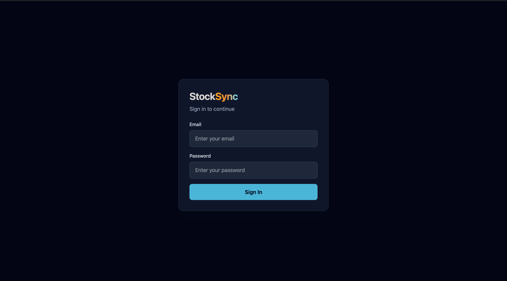
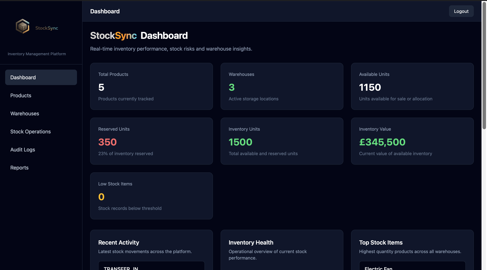
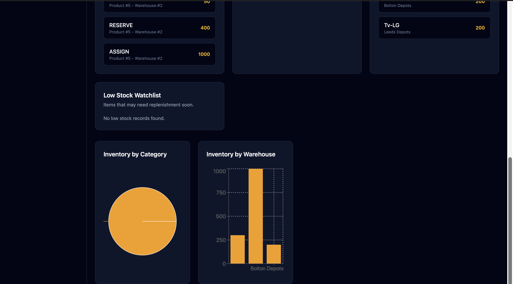
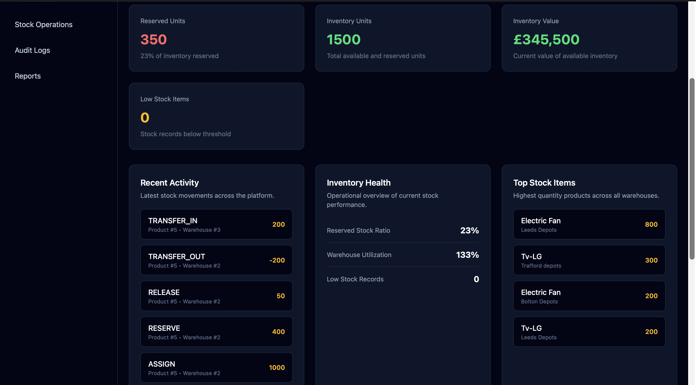
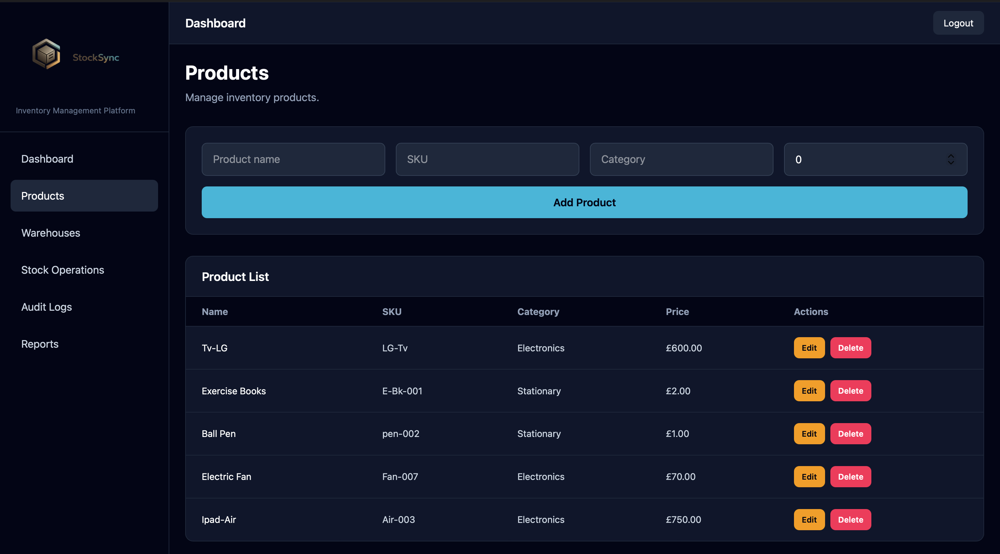
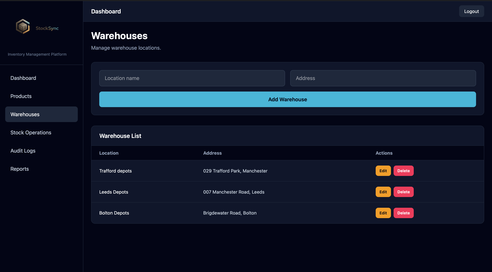
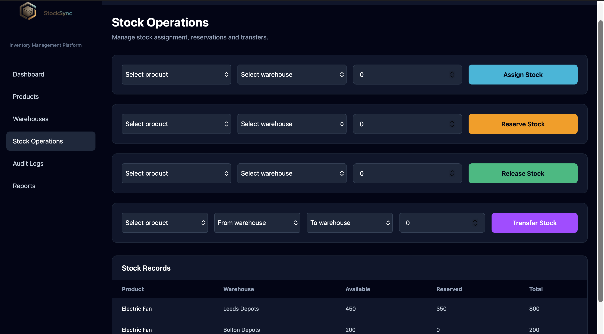
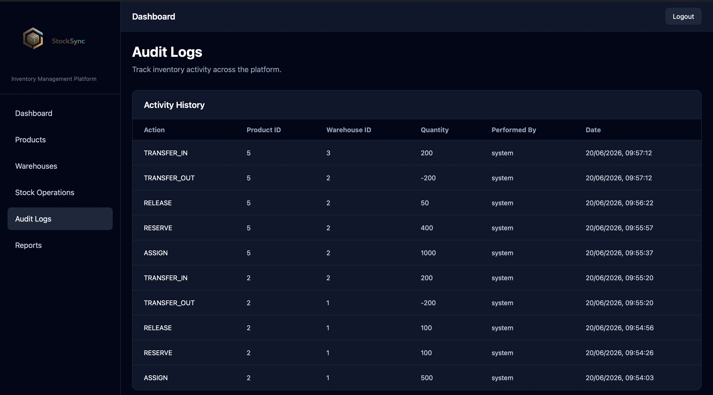
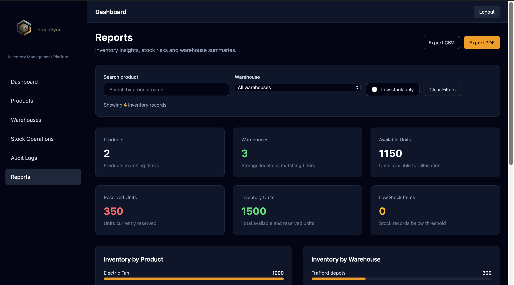
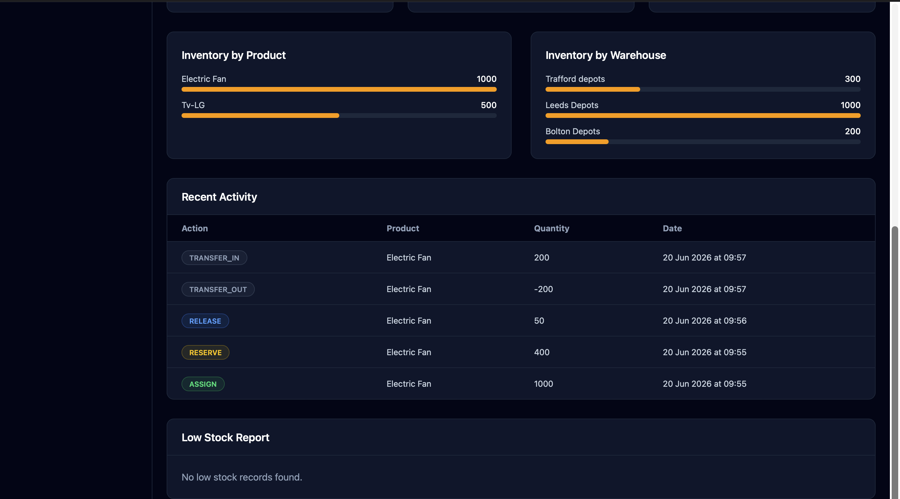

# StockSync

Enterprise Inventory Management Platform built with ASP.NET Core .NET 10, React, TypeScript, SQL Server, Azure App Service, and Azure SQL Database.

## Overview

StockSync is a full-stack inventory management platform designed to help organizations manage products, warehouses, stock allocation, reservations, transfers, reporting, and audit tracking through a modern web interface.

The platform demonstrates enterprise software engineering practices including authentication, service-layer architecture, REST APIs, inventory workflows, audit logging, reporting dashboards, Azure deployment, and CI/CD automation.

---

## Live Application

### Frontend

Azure Static Web Apps

### Backend API

Azure App Service

### Database

Azure SQL Database

---

## Technology Stack

### Frontend

* React
* TypeScript
* Vite
* Tailwind CSS
* React Router
* Axios

### Backend

* ASP.NET Core .NET 10
* Entity Framework Core
* SQL Server
* JWT Authentication
* REST API Architecture

### Cloud & DevOps

* Azure App Service
* Azure SQL Database
* Azure Static Web Apps
* GitHub Actions
* Git & GitHub

---

## Key Features

### Authentication

* JWT-based authentication
* Protected routes
* Secure API access

### Product Management

* Create products
* Update products
* Delete products
* Product categorization
* SKU management

### Warehouse Management

* Create warehouse locations
* Update warehouse information
* Delete warehouses
* Multi-location inventory support

### Stock Operations

* Assign stock
* Reserve stock
* Release reservations
* Transfer stock between warehouses

### Reporting & Analytics

* Inventory summaries
* Warehouse analytics
* Product analytics
* Stock utilization reporting
* Export capabilities

### Audit Logging

* Inventory activity tracking
* Historical operation records
* Transfer history
* Reservation history

---

## Screenshots

### Login

### Dashboard Overview

### Dashboard Analytics

### Recent Activity

### Products

### Warehouses

### Stock Operations

### Audit Logs

### Reports

### Reporting Analytics

---

## Architecture

Frontend (React + TypeScript)

↓

REST API

↓

ASP.NET Core .NET 10

↓

Entity Framework Core

↓

Azure SQL Database

---

## CI/CD

GitHub Actions automates:

* Build validation
* Test execution
* Deployment workflows

---

## Future Enhancements

* Role-based authorization
* User administration
* Inventory forecasting
* Low-stock notifications
* Supplier management
* Purchase orders
* Dashboard widgets
* Docker containerization

---

## Author

Daniel Okafor

Software Developer

GitHub:
https://github.com/austzdee
